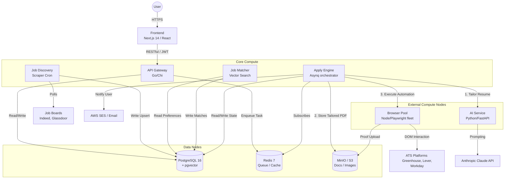

# System Architecture: AutoDreamApplier

AutoDreamApplier is a cloud-native SaaS application designed to automate the process of discovering jobs and applying to them using headless browsers and AI tailoring.

## 1. High-Level Ecosystem

The platform is designed around asynchronous job processing.
Because web automation (Playwright/Browser) and AI LLMs (Claude) are high-latency and prone to failure, the system completely segregates the core database and API away from heavy computational tasks via **Redis message queues**.

### Architectural Diagram

## 2. Core Operational Paradigms

### A. Non-Blocking Automation

Users never wait for an application to submit synchronously. The `API Gateway` only performs basic validation and instantly returns a `202 Accepted` response while queuing a background task into Redis. This prevents HTTP timeouts during multi-minute browser automations.

### B. Scalable Computation

By placing the heavy libraries (`Python/FastAPI` for vector encoding and `Node.js/Playwright` for DOM rendering) inside dedicated microservices (`ai-service` and `browser-pool`), these can be scaled out horizontally on cheap spot instances, while the Go core remains hyper-efficient.

### C. The Two-Stage Pipeline

1. **The Prep Stage (Cheap):** The `Apply Engine` fetches user data and queries the `AI Service` to tailor the resume to the job description. The result is saved to S3.
2. **The Execution Stage (Expensive):** Only after the prompt parsing is completely validated does the engine request a `Browser Pool` node to physically navigate the ATS form and inject the saved S3 resume.

If the AI fails, the browser slot is never wasted.

## 3. Data Flow Summaries

- **Authentication:** Development utilizes standard HMAC JWTs. Production is preconfigured to route through AWS Cognito (RSA verification middleware).
- **Match Lifecycle:** Scrapers yield `jobs` -> Matcher compares User Preferences -> Creates `matches` -> User approves -> Creates `applications` -> Apply Engine runs pipeline -> Status updates `applied` or `failed`.
- **Proof of Action:** The browser pool takes screenshots during final submission, uploads to S3, and standardizes the URL in Postgres so users see physical proof their application was filed.

---

*For deep-dives on individual services, see the respective documentation files in this directory.*
