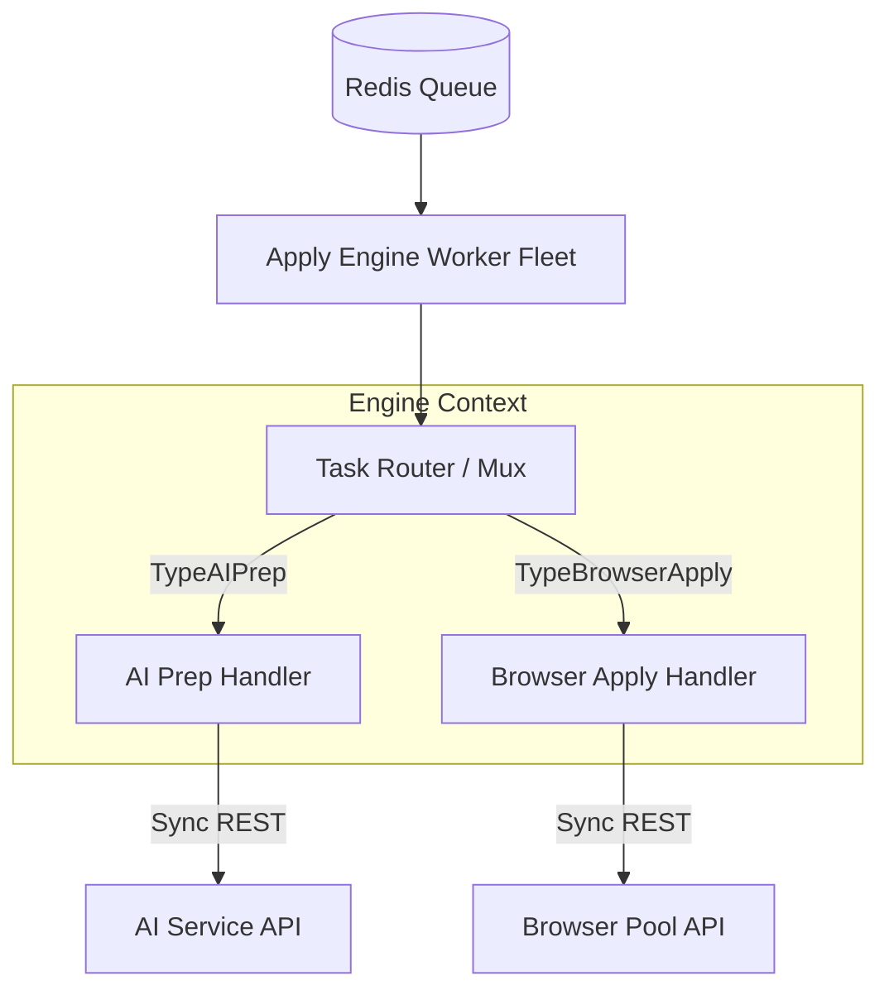

# Apply Engine Architecture (`cmd/apply-engine`)

The Apply Engine is the orchestrator of the AutoDreamApplier ecosystem. While the API Gateway creates tasks, the Apply Engine resolves them.

## 1. Overview
The engine runs independently from main traffic and utilizes **Asynq** (backed by Redis) to continuously poll for work. It executes the critical two-stage pipeline: **AI Preparation** and **Browser Application**.

## 2. Architecture & Components



## 3. The Two-Stage Application Pipeline

Navigating headless browsers is incredibly prone to DOM drift, rate limiting, and memory crashes. It is the most expensive operation in the system. 
To protect system resources, AI transformation is strictly decoupled from physical browser manipulation. 

### Stage 1: AI Preparation (`TypeAIPrep`)
When the Engine receives a `TypeAIPrep` task from Redis:
1. **Fetch Context:** The Engine reads the user's base resume and the explicit job description from PostgreSQL.
2. **AI Delegation:** The Engine makes a synchronous HTTP call to the internal `ai-service` containing the resume and job specs.
3. **Data Storage:** The `ai-service` responds with the newly restructured and targeted resume. The Engine uploads this document directly to MinIO/S3 (`autodream-resumes`).
4. **Transition:** The Engine updates the database `applications` table setting `tailored_resume_s3_key` and enqueues the secondary task: `TypeBrowserApply`.

*Failure Mode:* If the Anthropic API is rate-limited, Asynq automatically retries the task via exponential backoff. The Browser Pool is never utilized.

### Stage 2: Browser Execution (`TypeBrowserApply`)
When the Engine receives a `TypeBrowserApply` task:
1. **Pre-flight Checks:** The Engine verifies the `job` object has a supported `ATSType` via the internal `ATS Registry`. If no plugin exists, it bails out early.
2. **Payload Construction:** The Engine pulls the *tailored* Resume S3 Key from the database. It constructs a massive JSON payload containing every detail required by an ATS constraint (Full Name, Phone, Links, Resume Payload).
3. **Browser Delegation:** The Engine POSTs the payload to the ephemeral `browser-pool` service. 
4. **Conclusion:** If the `browser-pool` successfully inputs the data into the ATS (e.g., Lever), it automatically shoots a screenshot for proof and returns an S3 key. The Engine updates the Application status to `applied` and saves the proof key.

## 4. ATS Plugin Architecture & Extensibility
The Apply Engine inherently implements an ATS detector/registry within `internal/ats/plugins`.

All ATS Plugins (Lever, Workday, Greenhouse) follow a strict interface that standardizes validation and data models:
```go
type ATSPlugin interface {
    Detect(url string) bool
    Apply(ctx context.Context, pluginReq ApplicationData) Result
}
```
Currently, the `Apply` interface simply formulates requests to the browser pool. The design allows new plugins (e.g. `icims.go`) to be hot-dropped into the registry map without rewiring the pipeline.
