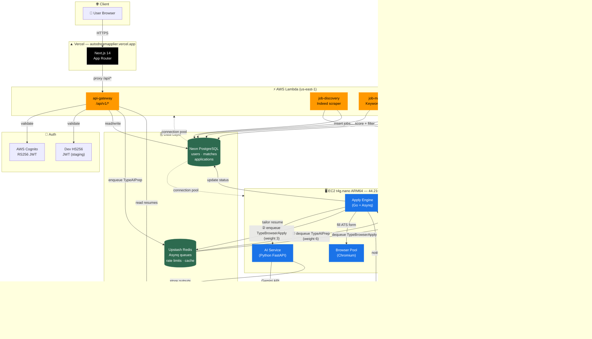

# AutoDreamApplier — System Architecture



## Layer Summary

| Layer | Technology | Hosting |
|-------|-----------|---------|
| Frontend | Next.js 14 App Router | Vercel |
| Auth | AWS Cognito (RS256) + Dev HS256 | AWS |
| API | Go (Chi router) | AWS Lambda |
| Job Discovery | Go + Indeed scraper | AWS Lambda |
| Job Matcher | Go + keyword scorer | AWS Lambda |
| Apply Engine | Go + Asynq workers | EC2 t4g.nano |
| Browser Pool | Chromium (headless) | EC2 t4g.nano |
| AI Service | Python FastAPI + Gemini | EC2 t4g.nano |
| Database | PostgreSQL | Neon (serverless) |
| Queue / Cache | Redis | Upstash |
| Object Storage | S3 | AWS |
| Email | SES | AWS |

## 2-Stage Async Pipeline

```
User approves match
      │
      ▼
Lambda enqueues TypeAIPrep ──► Upstash Redis (QueueAIPrep weight:6)
                                      │
                                      ▼
                              Apply Engine dequeues
                                      │
                                      ▼
                              AI Service (Gemini)
                              ├─ Tailor resume
                              └─ Generate cover letter
                                      │
                                      ▼
                              Store outputs in S3
                                      │
                                      ▼
                        Enqueue TypeBrowserApply ──► Redis (QueueBrowserApply weight:3)
                                      │
                                      ▼
                              Apply Engine dequeues
                                      │
                                      ▼
                              Browser Pool (Chromium)
                              └─ Fill ATS form + submit
                                      │
                                      ▼
                              Update DB status → notify via SES
```
